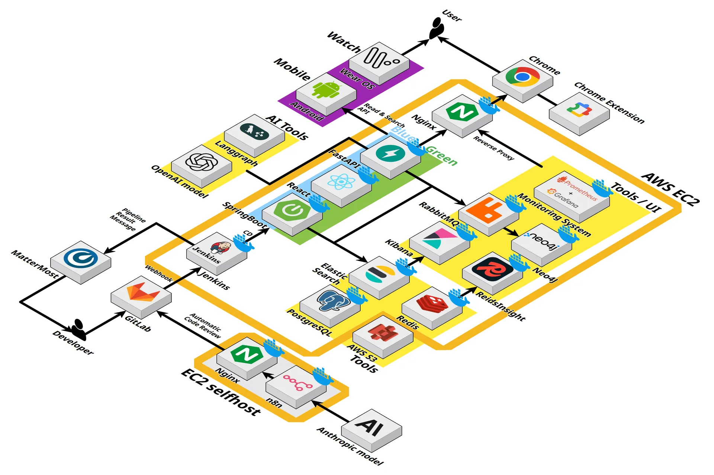
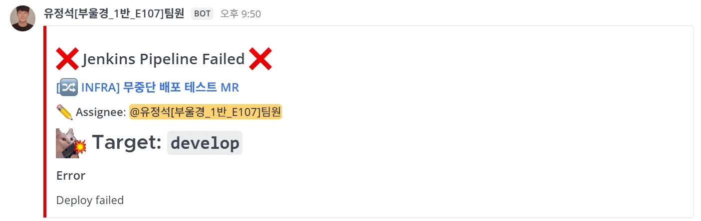
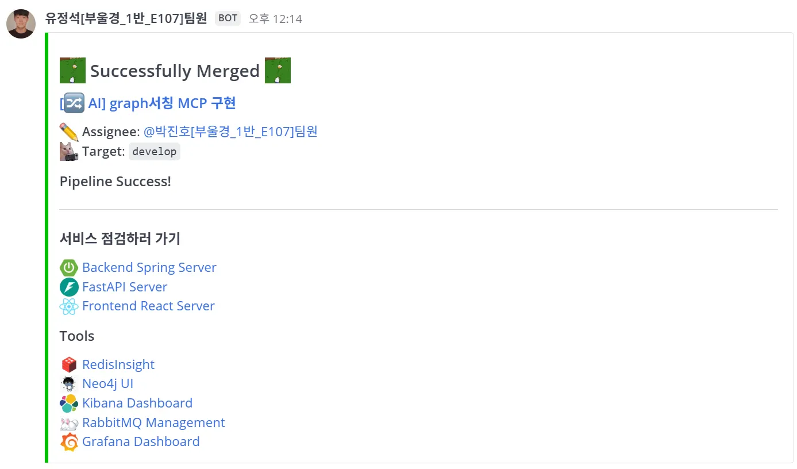
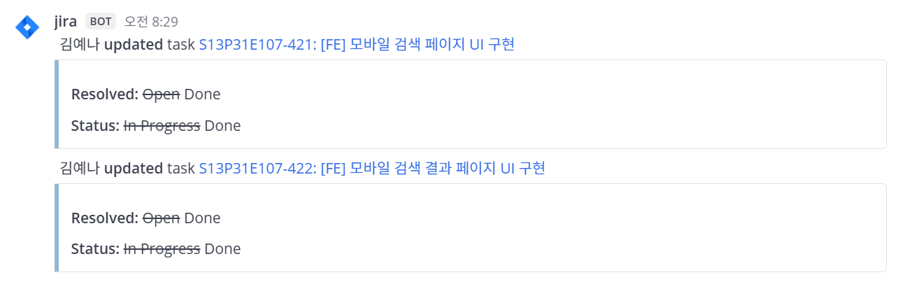
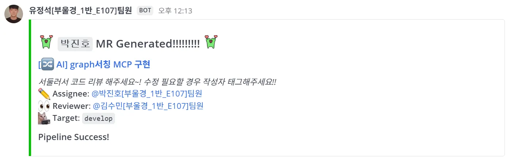
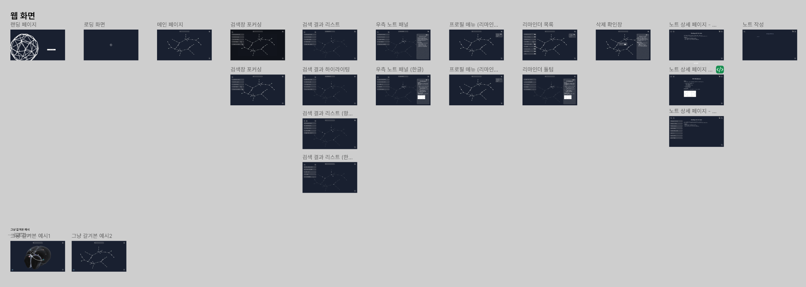
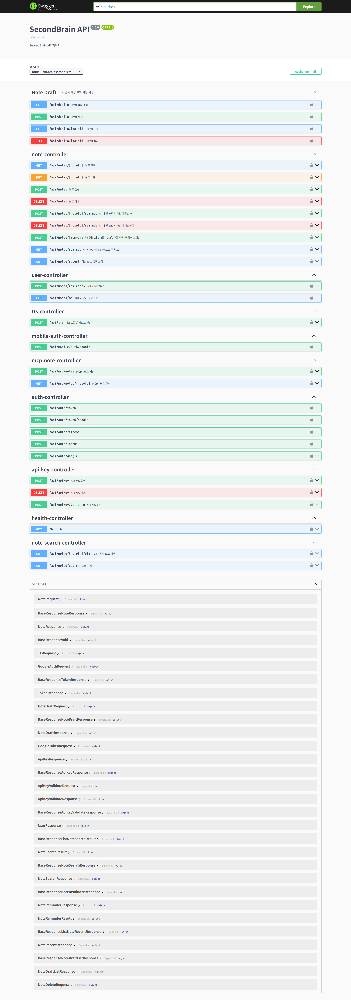
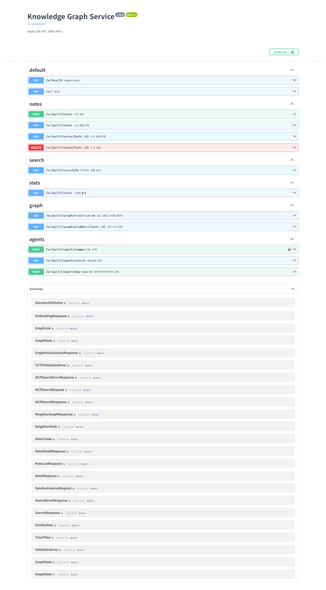

<div align="center">

# Second Brain


</div>

## 🔗**지식을 저장하고** 연결하여 **사용하세요**<br>

**지식을 노트로 저장**하고 **여러 디바이스에서 사용**하여 개인의 지식을 활용할 수 있습니다. **크롬 익스텐션과 MCP**를 통해 지식을 **쉽게 저장**하고 **쉽게 꺼내어** 연결된 지식과 인사이트를 얻으세요.<br/>

> ## Second Brain 프로젝트는
> 정보과부화 시대에 정보들은 기억 속에서 사라지거나 메모장 어딘가에 묻혀버려 장기기억으로 전환되지 못한다는 **문제의식**에서 출발했습니다. 우리의 서비스는 LLM과 인터넷을 통해 얻은 지식과 정보를 저장하고 연결하여 지식을 구조화하고, 쉽게 꺼내쓰면서 마치 **두 번째 뇌**를 가진 것과 같은 경험을 하게 해줍니다.

- **개발 기간** : 2025.10.02 ~ 2025.11.20 **(7주)**
- **플랫폼** : Web & App & Chrome extension & wear OS
- **개발 인원** : 6명 <br><br>

</div> <br>

## 🔎 목차

<div>

### <a href="#developers">🌟 팀원 구성</a>

### <a href="#skills">📲 기능 구성</a>

### <a href="#techStack">🛠️ 기술 스택</a>

### <a href="#directories">📂 프로젝트 구조도</a>

### <a href="#systemArchitecture">🌐 시스템 아키텍처</a>

### <a href="#projectDeliverables">📦 프로젝트 산출물</a>

</div>

<br>

## 🌟 팀원 구성

<a name="developers"></a>

<div align="center">

<div align="center">
<table>
    <tr>
        <td width="33%" align="center"> <a href="https://github.com/01seok">
             <br> 이석재 <br>(Backend) </a> <br></td>
        <td width="33%" align="center"> <a href="https://github.com/soomkim00">
             <br> 김수민 <br>(Backend) </a> <br></td>
        <td width="33%" align="center"> <a href="https://github.com/CometAve">
             <br> 노혜성 <br>(Backend & Frontend) </a> <br></td>
    </tr>
    <tr>
      <td width="280px">
        <sub>
          -  <br>
          -  <br>
          -  <br>
          - 
        </sub>
      </td>
      <td width="280px">
        <sub>
          -  <br>
          -  <br>
          - 
        </sub>
      </td>
      <td width="280px">
        <sub>
          -  <br>
          -  <br>
          -  <br>
          - 
        </sub>
      </td>
    </tr>

</table>

<table>
    <tr>
        <td width="33%" align="center"> <a href="https://github.com/PPPP98">
         <br> 박진호 <br>(Backend & AI) </a> <br></td>
        <td width="33%" align="center"> <a href="https://github.com/yeneua">
         <br> 김예나 <br>(Frontend) </a> <br></td>
        <td width="33%" align="center"> <a href="https://github.com/seok0205">
         <br> 유정석 <br>(DevOps) </a> <br></td>
    </tr>
    <tr>
        <td width="280px">
          <sub>
            -  <br>
            -  <br>
            - 
          </sub>
        </td>
        <td width="280px">
          <sub>
            -  <br>
            -  <br>
            -  <br>
            - 
          </sub>
        </td>
        <td width="280px">
          <sub>
            -  <br>
            -  <br>
            - 
          </sub>
        </td>
    </tr>

</table>
</div>
<br>

</div>

## 📲 기능 구성

<a name="skills"></a>

<div align="center">

## 지식을 연결하고 시각화 할 수 있습니다.


</div>
<br>

## 🛠️ 기술 스택

<a name="techStack"></a>

### 🌕 Frontend

<div align="center">


<br>


<br>

|      **Category**       |                                                 **Stack**                                                  |
| :---------------------: | :--------------------------------------------------------------------------------------------------------: |
|      **Language**       |                                                                                                            |
| **Runtime Environment** |                                                                                                            |
|      **Framework**      |                                                                                                            |
|       **Library**       |                                                                                                            |

</div>

### 🌑 Backend

<div align="center">


<br>

<br>


<br>

|      **Category**       |                                                 **Stack**                                                  |
| :---------------------: | :--------------------------------------------------------------------------------------------------------: |
|      **Language**       |                                                                                                            |
|      **Framework**      |                                                                                                            |
|       **Library**       |                                                                                                            |
|      **Database**       |                                                                                                            |
</div>

### 🤖 AI

<div align="center">

<br>

<br>

|      **Category**       |                                                 **Stack**                                                  |
| :---------------------: | :--------------------------------------------------------------------------------------------------------: |
|      **Language**       |                                                                                                            |
|      **Framework**      |                                                                                                            |
|       **Library**       |                                                                                                            |
|      **Database**       |                                                                                                            |

</div>

### ⚙️ DevOps

<div align="center">


<br>


|    **Category**     |             **Spec**              |
| :-----------------: | :-------------------------------: |
|  **Instance Type**  |             T2.XLARGE             |
|       **CPU**       |              4 vCPUs              |
|       **RAM**       |               16 GB               |
| **Storage (Disk)**  |      SSD: 320 GB, HDD: 6 TB       |
|     **Docker**      |              v28.1.1              |
| **Docker Compose**  |              v2.38.2              |
|     **Jenkins**     |               2.520               |
|      **Nginx**      |           nginx/1.18.0            |

</div>

### 🤝 Collaboration

<div align="center">


</div>
<br>

## 📂 프로젝트 구조도

<a name="directories"></a>

```
S13P31E107/...
├─ backend/secondbrain/...
│  ├─ Dockerfile
│  └─ main.py
│
├─ agent-MCP/...
│  ├─ services/...
│  ├─ .env-example
│  └─ main.py
│
├─ knowledge-graph-service/...
│  ├─ app/...
│  ├─ Dockerfile
│  └─ main.py
│
├─ extension/...
│  ├─ src/...
│  ├─ Dockerfile
│  ├─ package.json
│  └─ README.md
│
├─ frontend/...
│  └─ secondbrain/...
│     ├─ Dockerfile
│     ├─ src/...
│     └─ package.json
│
├─ mobile_watch/...
│  └─ secondbrain/...
│     ├─ build.gradle.kts
│     ├─ mobile/...
│     │   ├─ src/...
|     │   └─ build.gradle.kts
│     └─ wear/...
│         ├─ src/...
|         └─ build.gradle.kts
│
└─ Deploy/...
   ├─ jenkins, grafana, nginx.../...
   ├─ docker-compose.yml
   └─ Jenkinsfile
```

## 🌐 시스템 아키텍처

<a name="systemArchitecture"></a>

### 🖧 System Architecture

<div align="center">


</div>

### 🚀 Code review pipeline - n8n

<div align="center">


</div>

### 📢 Collaboration & Event Notification

<div align="center">

<table>
  <tr>
    <td align="center" width="50%"><b>❌ Jenkins Pipeline Failure</b></td>
    <td align="center" width="50%"><b>✅ Jenkins Pipeline Success</b></td>
  </tr>
  <tr>
    <td align="center"></td>
    <td align="center"></td>
  </tr>
  <tr>
    <td align="center" width="50%"><b>🗨️ Jira Issue Notification</b></td>
    <td align="center" width="50%"><b>🔀 Merge Request Created Notification</b></td>
  </tr>
  <tr>
    <td align="center"></td>
    <td align="center"></td>
  </tr>
</table>

</div>

<br>


## 📦 프로젝트 산출물

<a name="projectDeliverables"></a>

<h3>🖼️ 화면 설계서</h3>
<div align="center">


</div>

<h3>✅ Swagger API Docs</h3>
<details align="left">
  <summary>
    <strong>자세히</strong>
  </summary>

  <div align="center">

  
  
  </div>
</details>

<h3><a href="https://lemon-parrotfish-cb5.notion.site/2841d7b5e16e81a1a4dcc03071016a08" target="_blank">📋 기능 명세서</a></h3>